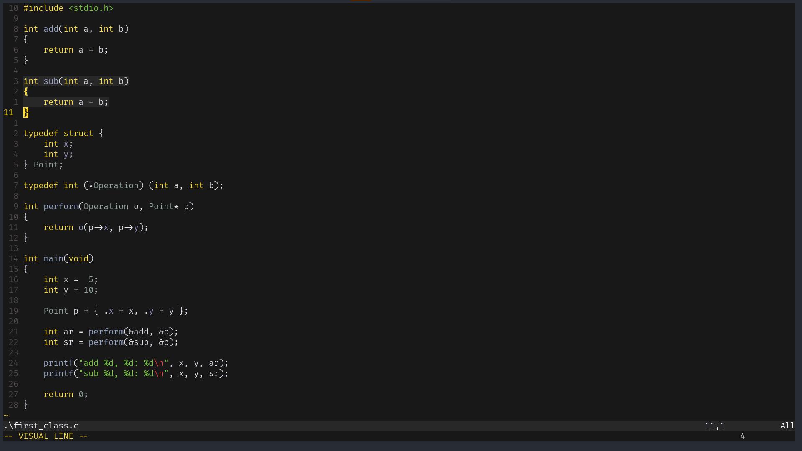

# Gruber Darker
Emacs' [Gruber Darker](https://github.com/rexim/gruber-darker-theme) theme port for Neovim.

# Installation
Through nvim's package manager, in your `init.lua`, download the theme:
```lua
vim.pack.add {
    "https://github.com/0x45454545/gruber-darker.nvim",
}
```
then, import the theme:
```lua
local gruber = require "gruber-darker"
```
and load it with the default style:
```lua
gruber.load(gruber.style.default)
```
or the bit more modern style (treesitter required for full functionality):
```lua
gruber.load(gruber.style.modern)
```

# Preview

